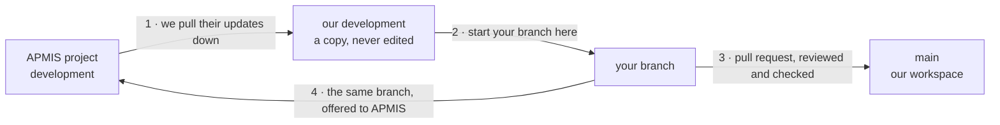

# APMIS — working fork

Working fork of [AFG-Polio-Data/APMIS-Project](https://github.com/AFG-Polio-Data/APMIS-Project), used for the engagement to raise application quality through tests and a better developer workflow.

APMIS is derived from [SORMAS](https://github.com/hzi-braunschweig/SORMAS-Project). The upstream SORMAS readme — module descriptions, server setup, contribution guides — is preserved at [`apmis-readme.md`](apmis-readme.md) and is still the reference for anything this file does not cover.

## How we work

We are a small team working on testing and the developer workflow, separate from the APMIS application developers. We work in this fork. Our changes reach the APMIS team by being offered to them one at a time, for them to accept or refuse.

This section explains how the arrangement works and why. For the commands to type, see [**Team workflow — a step by step guide**](docs/TEAM_WORKFLOW.md).

### Three kinds of branch, each with one job

**`development` — our copy of the APMIS project.**
This branch exists to stay identical to `AFG-Polio-Data:development`. We never edit it. Nothing is committed here directly and no pull request targets it. Its only job is to follow along as the APMIS developers make changes.

**`main` — our workspace.**
Everything we build lands here. This is where our work comes together, where the checks run against all of it, and what we would demo from. Some of what lives here will never go to the APMIS team, and that is fine.

**Your branch — one piece of work.**
Short-lived. Started from `development`, finished when the work is merged.

### The flow



**1. We keep our copy current.** `development` is updated from the APMIS project regularly. Because nobody edits it, this never causes a conflict — it simply catches up.

**2. You start your branch from `development`.** Not from `main`. This matters, and the next section explains why.

**3. You open a pull request into `main`.** That is where it gets reviewed and where the checks run. Once approved and merged, the work is part of what we have built.

**4. The same branch is then offered to the APMIS team**, as a second pull request into their `development`. Same branch, different destination. No new branch, no copying commits across.

### Why start from `development` rather than `main`

A branch started from our copy of the APMIS project contains **only your change**. That is what makes it something the APMIS developers can look at and say yes to.

A branch started from `main` would also carry everything else our team has ever done. Offering that means asking the APMIS developers to accept all of it at once. We have tried that twice on this project and both attempts were closed without discussion.

The same reasoning is why we never offer `main` itself upstream. `main` is a destination, not a starting point.

### The one rule that keeps this working

**Never merge `main` into your branch.**

The moment you do, your branch stops containing only your change and starts carrying the team's whole history again. That is how a clean offer turns into the kind nobody accepts, and it has already happened once here.

If your branch has gone stale and needs the latest from the APMIS project, rebase it onto `development` instead. Ask rather than guess — this is the one operation worth getting help with.

### When your work depends on something we have not offered yet

Sometimes a change only makes sense on top of an earlier one that has not reached the APMIS project. Start from that earlier branch, and wait until it has been accepted before offering yours.

This is not a problem to work around. It is telling you the change is not ready to stand on its own yet.

### Branch names

| Prefix | For |
|---|---|
| `test/` | New or extended tests |
| `ci/` | Workflows, gates, pipeline |
| `fix/` | Defects |
| `docs/` | Documentation |
| `chore/` | Dependencies, tooling, housekeeping |

Include the issue number where there is one: `test/25-version-matrix`.

### Commits

Use `type(scope): summary` — the type matches your branch prefix, the scope is the module (`app`, `api`, `backend`, `flow`, or left out for repo-wide changes).

Explain **why** in the body, not what. The diff already shows what changed. What it cannot show is what you ruled out, or which failure you were chasing. A commit explaining why the Android workflow needs JDK 17 is what stops the next person changing it back.

### Before you open a pull request

- The checks pass. If one is red, say why in the description rather than leaving the reviewer to work it out.
- The issue it closes is linked.
- For a test, say what would now fail that used to pass silently. A test that cannot fail is not coverage.
- If you found something else broken, raise an issue rather than making the pull request bigger.

### Reviewing, with a team this size

There are two or three of us, and the person approving also writes code. Review cannot be a safety net here — the automated checks are what actually catch mistakes, because a check cannot be persuaded.

What review is for is making sure no one person is the only one who understands something we have built. If a pull request is the only place a decision was written down, it is not documented.

### Done means

Merged into `main`, the checks proved it, and anything it uncovered is either fixed or written up as an issue. Not "it works on my machine".

## Where work is tracked

Issues on this repository, grouped on the **APMIS Testing** project board.

| Label | Meaning |
|---|---|
| `phase-1` | Turn the lights on — make the build and its signal real |
| `phase-2` | Protect the field — contract tests between modules |
| `wiring` | Pipeline plumbing, done before adding tests |
| `good first task` | Small, self-contained, safe to pick up cold |

Pull requests land on `development` here. Changes intended for upstream are raised separately and kept narrow.

## Building

**Java 17.** The parent pom sets `<release>17</release>`; a JDK 11 toolchain fails to compile `sormas-api`.

```bash
cd sormas-base
mvn verify          # ~7 minutes, all server modules
```

The Android app resolves `de.symeda.sormas:sormas-api` from `mavenLocal()`, so that module must be installed by Maven **before** Gradle runs:

```bash
cd sormas-base && mvn install -pl :sormas-api -am -DskipTests
cd ../sormas-app && ./gradlew :app:assembleDebug :app:testDebugUnitTest
```

## Test coverage as it stands

Honest baseline, measured on this branch:

| Module | Unit tests | Runs in CI |
|---|---|---|
| `sormas-api`, `sormas-backend`, `sormas-ui`, `sormas-rest`, `apmis-flow` | none | — |
| `sormas-app` | 3 files | yes |
| `sormas-e2e-tests` | 22 Cucumber features | not yet |

`mvn verify` reaches `failsafe:integration-test` on every module and runs nothing server-side. JUnit, Mockito, JaCoCo and Surefire are already inherited from `sormas-base/pom.xml`, so a test placed in `<module>/src/test/java/` runs with no build changes.

## Things that will catch you out

Each of these cost real time to find.

**The Android workflow's JDK is tied to the server, not the app.** `sormas_app_ci.yml` must use JDK 17 because it builds `sormas-api` with Maven first. Setting it to match the app's bytecode target breaks the build.

**Two migration counters move together.** The server schema (`sormas_schema.sql`, `INSERT INTO schema_version`, currently 498) and the app's local database (`DatabaseHelper.DATABASE_VERSION`, currently 359). Both are append-only single files, so parallel work collides on them. Rebase before merging.

**A cross-module change is atomic by necessity.** `sormas-api` is compiled against by the backend, UI, REST layer and the Android app. Adding a DTO field and deferring the app half leaves `development` uncompilable for everyone.

**A path-filtered check cannot be a required check.** `sormas_app_ci.yml` only triggers on `sormas-app/**` and `sormas-api/**`. Marking it required would leave a `sormas-ui`-only pull request waiting forever for a result that never arrives.

**Beware a build that passes for the wrong reason.** Three failures were stacked here at one point, each hiding the next: checkout failed on a missing secret, then dependency resolution failed on a withdrawn Vaadin beta, then compilation failed on a class that had never been committed. A green tick after fixing one only means the next one is now visible.

## Modules

As upstream, plus `apmis-flow` (Vaadin 23 web module, APMIS-specific). Full descriptions in [`apmis-readme.md`](apmis-readme.md#project-structure).

## Licence

GPL v3, as upstream. See [`LICENSE`](LICENSE).
