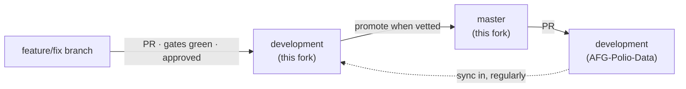

# APMIS — working fork

Working fork of [AFG-Polio-Data/APMIS-Project](https://github.com/AFG-Polio-Data/APMIS-Project), used for the engagement to raise application quality through tests and a better developer workflow.

APMIS is derived from [SORMAS](https://github.com/hzi-braunschweig/SORMAS-Project). The upstream SORMAS readme — module descriptions, server setup, contribution guides — is preserved at [`apmis-readme.md`](apmis-readme.md) and is still the reference for anything this file does not cover.

## How we work

We are a small team working on testing and developer workflow, separate from the APMIS application developers. We contribute to **this fork only**. Nothing we write goes directly to `AFG-Polio-Data/APMIS-Project`; it reaches them through a reviewed promotion, described below.



Four rules follow from that shape.

**1. Work lands on `development` here, through a pull request.**
No direct pushes. Every change is a pull request into `development` on this fork, and it needs both the gates green and an approving review before it merges. Approval currently rests with the repository owner.

**2. `master` on this fork means "vetted, ready to propose upstream".**
This is *not* what `master` means upstream, where it tracks released production. Here it is a staging point: things that have proven themselves on `development` get promoted to `master`, and `master` is what we raise upstream from. Nothing is promoted because it merged — it is promoted because we are prepared to defend it to the APMIS developers.

**3. Upstream pull requests come from `master`, and stay narrow.**
One concern per pull request. The APMIS developers are being asked to adopt gates and builds they did not write, so each proposal has to be reviewable on its own terms. A pull request bundling a workflow change, a dependency fix and a test is much harder to accept than three that each do one thing.

**4. Sync *in* from upstream often.**
`development` here must stay current with `AFG-Polio-Data:development`. Divergence is what makes upstream pull requests conflict, and it compounds quietly — the four-layer build failure this fork untangled was partly a product of drift. Sync in from upstream's `development`; never sync upstream's `master` into ours, because the two mean different things.

### Branch names

| Prefix | For |
|---|---|
| `test/` | New or extended tests |
| `ci/` | Workflows, gates, pipeline |
| `fix/` | Defects |
| `docs/` | Documentation |
| `chore/` | Dependencies, tooling, housekeeping |

Include the issue number where there is one: `test/25-version-matrix`.

### Commits

Conventional commits — `type(scope): summary`. The type matches the branch prefix; the scope is the module (`app`, `api`, `backend`, `flow`, or omitted for repo-wide).

Explain *why* in the body, not what. The diff shows what changed; it cannot show what you ruled out, or which failure you were chasing. A commit whose body explains why the Android workflow needs JDK 17 stops the next person "correcting" it back.

### Before you open a pull request

- Gates pass. If a check is red, say why in the description rather than leaving a reviewer to work it out.
- The issue it closes is linked.
- Test tickets state what would now fail that previously passed silently. A test that cannot fail is not coverage.
- If you found something unrelated and broken, raise an issue rather than widening the pull request.

### Reviewing, with a team this size

With two or three of us, review cannot be a safety net — we are each other's only reviewer, and the approver is also a contributor. So the automated gates carry the weight: a check cannot be talked into approving something.

What review is for here is knowledge transfer. Nobody should be the only person who understands a mechanism we have built. If a pull request is the only place a decision is recorded, that decision is not documented.

### Definition of done

A ticket is done when the change is merged to `development` here, the gates prove it, and anything it revealed is either fixed or ticketed. Not when the code works locally.

## Where work is tracked

Issues on this repository, grouped on the **APMIS Testing** project board.

| Label | Meaning |
|---|---|
| `phase-1` | Turn the lights on — make the build and its signal real |
| `phase-2` | Protect the field — contract tests between modules |
| `wiring` | Pipeline plumbing, done before adding tests |
| `good first task` | Small, self-contained, safe to pick up cold |

Pull requests land on `development` here. Changes intended for upstream are raised separately and kept narrow.

## Building

**Java 17.** The parent pom sets `<release>17</release>`; a JDK 11 toolchain fails to compile `sormas-api`.

```bash
cd sormas-base
mvn verify          # ~7 minutes, all server modules
```

The Android app resolves `de.symeda.sormas:sormas-api` from `mavenLocal()`, so that module must be installed by Maven **before** Gradle runs:

```bash
cd sormas-base && mvn install -pl :sormas-api -am -DskipTests
cd ../sormas-app && ./gradlew :app:assembleDebug :app:testDebugUnitTest
```

## Test coverage as it stands

Honest baseline, measured on this branch:

| Module | Unit tests | Runs in CI |
|---|---|---|
| `sormas-api`, `sormas-backend`, `sormas-ui`, `sormas-rest`, `apmis-flow` | none | — |
| `sormas-app` | 3 files | yes |
| `sormas-e2e-tests` | 22 Cucumber features | not yet |

`mvn verify` reaches `failsafe:integration-test` on every module and runs nothing server-side. JUnit, Mockito, JaCoCo and Surefire are already inherited from `sormas-base/pom.xml`, so a test placed in `<module>/src/test/java/` runs with no build changes.

## Things that will catch you out

Each of these cost real time to find.

**The Android workflow's JDK is tied to the server, not the app.** `sormas_app_ci.yml` must use JDK 17 because it builds `sormas-api` with Maven first. Setting it to match the app's bytecode target breaks the build.

**Two migration counters move together.** The server schema (`sormas_schema.sql`, `INSERT INTO schema_version`, currently 498) and the app's local database (`DatabaseHelper.DATABASE_VERSION`, currently 359). Both are append-only single files, so parallel work collides on them. Rebase before merging.

**A cross-module change is atomic by necessity.** `sormas-api` is compiled against by the backend, UI, REST layer and the Android app. Adding a DTO field and deferring the app half leaves `development` uncompilable for everyone.

**A path-filtered check cannot be a required check.** `sormas_app_ci.yml` only triggers on `sormas-app/**` and `sormas-api/**`. Marking it required would leave a `sormas-ui`-only pull request waiting forever for a result that never arrives.

**Beware a build that passes for the wrong reason.** Three failures were stacked here at one point, each hiding the next: checkout failed on a missing secret, then dependency resolution failed on a withdrawn Vaadin beta, then compilation failed on a class that had never been committed. A green tick after fixing one only means the next one is now visible.

## Modules

As upstream, plus `apmis-flow` (Vaadin 23 web module, APMIS-specific). Full descriptions in [`apmis-readme.md`](apmis-readme.md#project-structure).

## Licence

GPL v3, as upstream. See [`LICENSE`](LICENSE).
